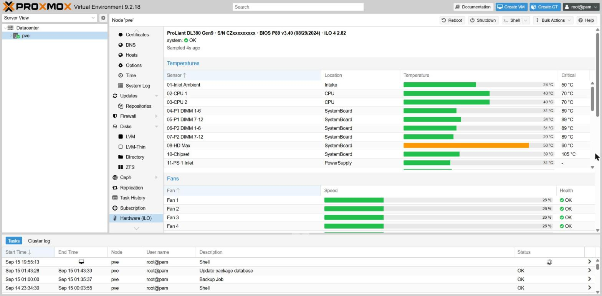
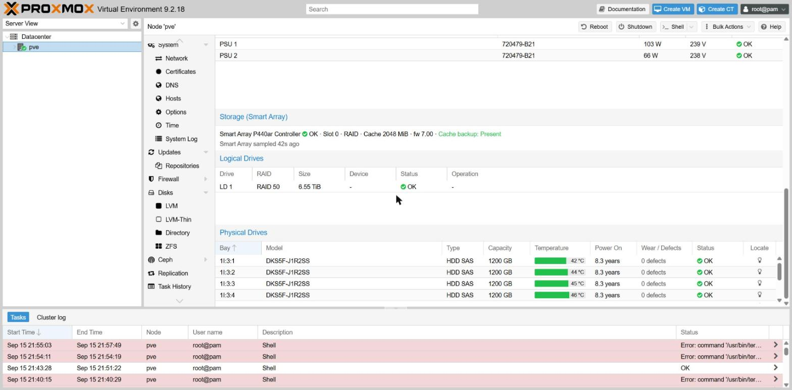

# pve-hpe-ilo

A "Hardware (iLO)" tab inside the Proxmox VE web interface, showing temperatures,
fan speeds, power draw and Smart Array RAID state read from an HPE ProLiant's
iLO over Redfish.

Built for a **DL380 Gen9 / iLO 4**, and written to also handle iLO 5/6 (Gen10+),
whose Redfish schema names several fields differently.





```
iLO (Redfish) ──► pve-hpe-ilo-poller ──► /run/pve-hpe-ilo/telemetry.json
   HTTPS            systemd, 30s                     │
                                 PVE::HPEiLO::API ◄──┘
                                        │  GET /api2/json/nodes/{node}/hpe-ilo
                                        ▼
                          /pve2/js/pve-hpe-ilo.js  ──►  node tab
```

The poller exists so that the API handler never waits on the BMC. iLO 4 needs
one to three seconds per Redfish call and tolerates few concurrent sessions; a
synchronous handler would tie up a `pvedaemon` worker on every GUI refresh.

## Why it patches two files

Proxmox VE has no plugin API for the web interface. The only official plugin
system is `PVE::Storage::Plugin`, which is for storage backends and cannot add
views or API routes. Proxmox staff have confirmed on the forum that no
supported UI-extension mechanism exists yet.

So two upstream files get one line each:

| File | Added | Owned by |
| --- | --- | --- |
| `/usr/share/perl5/PVE/API2/Nodes.pm` | guarded `require` that registers the API path | `libpve-access-control` |
| `/usr/share/pve-manager/index.html.tpl` | `<script>` tag for the panel | `pve-manager` |

Everything else lives in this package's own files. In particular
**`pvemanagerlib.js` is never modified** — the tab is added with an ExtJS
override, so a new pve-manager release cannot conflict with an edited bundle.

Both hooks are reapplied automatically by an apt `DPkg::Post-Invoke` hook, since
upgrading either package silently reverts them.

## Install

**[INSTALL.md](INSTALL.md) has the full walkthrough**, including the iLO-side
preparation and what to check when something does not appear. The short version,
as root on the node:

```sh
apt install -y git
git clone https://github.com/Kamaar/pve-hpe-ilo.git /root/pve-hpe-ilo
cd /root/pve-hpe-ilo && ./install.sh
```

Then:

1. Put your iLO details in `/etc/pve-hpe-ilo/config.json` (see
   `etc/config.example.json`). A read-only iLO user is enough.
2. `pve-hpe-ilo probe` — confirms iLO answers and prints what it returns.
3. `systemctl enable --now pve-hpe-ilo`
4. Hard-refresh the GUI (Ctrl-Shift-R) and open a node.

`./install.sh --uninstall` reverses all of it and leaves the config file behind.

### iLO user

Create a dedicated account in iLO with **no privileges ticked at all**. It can
still log in and read Redfish, which is all this needs, and cannot power-cycle
the host if the credentials ever leak. Redfish `Thermal` and `Power` are
readable with an iLO Standard licence; a few OEM fields need Advanced, and those
come back missing rather than failing.

## Commands

```sh
pve-hpe-ilo probe                          # live sample, formatted
pve-hpe-ilo probe --json                   # same, machine readable
pve-hpe-ilo probe --no-storage             # skip the slow Smart Array walk
pve-hpe-ilo show                           # the cached sample the GUI reads
pve-hpe-ilo status                         # one line; exit 2 when unhealthy
pve-hpe-ilo version                        # package version
pve-hpe-ilo smart                          # diagnose the smartctl enrichment
pve-hpe-ilo raw /redfish/v1/Chassis/1/Thermal/   # any Redfish resource

pve-hpe-ilo-patch --check                  # are both hooks still in place?
pve-hpe-ilo-patch                          # reapply them
pve-hpe-ilo-patch --remove                 # revert to pristine files
```

`raw` is the one to reach for when a reading looks wrong: it prints exactly
what your firmware returns, which is how the iLO 4 / iLO 5 differences below
were pinned down.

## Smart Array (hardware RAID)

Read out-of-band through iLO's OEM `SmartStorage` tree, so nothing has to be
installed on the host. Per controller you get model, firmware, operating mode,
cache size, **cache backup power status**, and rebuild priority; per logical
drive the RAID level, size, `/dev` name, health and any rebuild or parity
initialization with its percentage; per physical drive the bay, model, media
type, capacity, temperature, power-on hours, SSD wear and health.

The cache capacitor is worth calling out: when it fails, the controller
silently drops from write-back to write-through and everything just gets slow,
with nothing in the host logs to say why.

Two caveats specific to Gen9:

- The walk costs **one HTTP request per physical drive**, and iLO 4 answers in
  one to three seconds. It therefore runs on its own cycle — `storage_interval`,
  300s by default — and the last result is carried forward in between, with its
  age shown in the panel. Do not lower it to match the thermal interval.
- Drive temperatures and power-on hours often come back as `0`. That happens
  with third-party disks in HP carriers: the backplane only carries that data
  for drives running HPE firmware, so neither iLO nor `ssacli` sees it. The
  package works around this — see below. Run `pve-hpe-ilo probe` to see what
  your own firmware returns before assuming a field is broken.

### Drive temperatures from smartctl

When iLO leaves a drive's temperature or run time empty, the poller fills them
from `smartctl -d cciss,N`, which reaches each disk through the controller's
passthrough rather than the backplane and therefore works with any drive.
smartmontools ships with Proxmox VE, so this adds no dependency; if it is
missing the panel simply keeps showing what iLO gave it.

Readings are joined to drives **by serial number**. The `cciss` index order does
not follow bay order — on the reference machine index 0 is the disk in bay
`1I:3:4` — so a positional join would put readings against the wrong disk.
Values iLO did supply are never overwritten.

Turn it off with `"smart": false` in the config.

Changing the RAID configuration is **not** possible this way: `SmartStorage` is
read-only on iLO 4, and the writable `SmartStorageConfig` resource is Gen10 and
later. Configuration on Gen9 needs `ssacli` running on the host.

## Firmware differences this handles

| | iLO 4 (Gen8/Gen9) | iLO 5+ (Gen10+) |
| --- | --- | --- |
| Fan name | `FanName` | `Name` |
| Fan reading | `CurrentReading` | `Reading` |
| Fan units | `Units` | `ReadingUnits` |
| OEM block | `Oem.Hp` | `Oem.Hpe` |
| Base path | `/redfish/v1`, or `/rest/v1` below firmware 2.00 | `/redfish/v1` |

Absent fan bays and unpopulated sensors are filtered out: iLO lists them with a
reading of 0, which would otherwise show up as a dead fan and a frozen CPU.

### Locate LED

The physical drive grid has a lightbulb button per bay that lights the drive's
locate LED, so eight identical disks can be told apart before one is pulled.
It needs `ssacli` on the host (HPE's Management Component Pack); when that is
absent the control is disabled rather than offered and failing.

This is the only thing the package writes to hardware, and it is deliberately
the smallest write possible. It lives behind its own API path requiring
`Sys.Modify` on the node, separate from the read-only panel which needs only
`Sys.Audit`, and the bay address is validated against a strict pattern before
it is ever passed to `ssacli`.

## What this cannot do

Apart from the locate LED above, this package is **read-only**, for two
separate reasons.

**Fan control.** On HPE hardware the BMC owns the fan curve and exposes no
supported way to set it. The fan mods circulating for Gen8/Gen9 rely on
undocumented iLO 4 SSH commands tied to specific firmware builds.

**RAID configuration.** iLO 4's `SmartStorage` tree is read-only; the writable
`SmartStorageConfig` resource arrived with Gen10. Creating or deleting arrays,
changing cache ratio or lighting a drive LED on a Gen9 needs `ssacli` from
HPE's Management Component Pack running on the host, which is a different
integration with a very different risk profile — a mis-click in a web panel
should not be able to destroy an array.

## Development

The collector is testable without a server: recorded iLO payloads live in
`t/fixtures/`, and the patcher is exercised against stand-in copies of the two
Proxmox files.

```sh
make test     # all three suites, no node needed
make check    # on the node: hooks present, service up, sample fresh
```

`t/normalize.t` pins the Redfish mapping, `t/smart.t` the smartctl parsing and
the serial-number join, and `t/patch.sh` drives the patcher against stand-in
copies of the two Proxmox files — including the case that matters most, an
upgrade wiping the hooks and the apt hook restoring them.

## License

AGPL-3.0-or-later, the same licence as Proxmox VE. See [LICENSE](LICENSE).

## Status

Running on a DL380 Gen9 / iLO 4 2.82 under Proxmox VE 9.2.18. The Redfish
mapping for iLO 5/6 is written from HPE's schema documentation and covered by
tests, but has not been exercised against real Gen10 hardware — reports
welcome.
